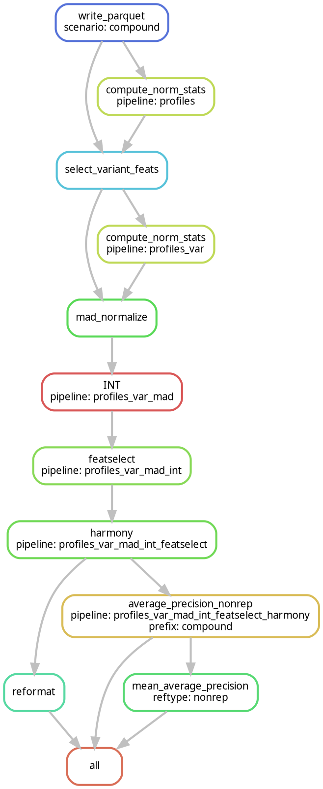

# JUMP Profiling Recipe Documentation

## Overview

The JUMP Profiling Recipe provides a Snakemake workflow designed for preprocessing and analyzing JUMP dataset profiles.
This workflows were created with the very specific goal of processing JUMP Cell Painting data, so it contains many dataset-specific components tailored to the unique characteristics of JUMP data.

## Quick Start

Install

```bash
git clone <repository-url>
cd jump-profiling-recipe
uv sync && uv pip install -e .
source .venv/bin/activate
```

Download well-level aggregated profiles

```bash
source download_data.sh compound  # Replace with crispr or orf as needed
```

Choose a configuration file (e.g., `compound.json` for processing compound data or `pipeline_1.json` for processing all perturbation types together):

```bash
snakemake -c4 --configfile inputs/config/compound.json
```

## Detailed Documentation

### Data Types

The [JUMP dataset](https://www.biorxiv.org/content/10.1101/2023.03.23.534023) contains three perturbation types:
1. **Compound**: Small molecule perturbations
2. **CRISPR**: Gene knockout using CRISPR-Cas9
3. **ORF**: Gene overexpression using open reading frames (ORFs)

### Workflow Structure

#### Main Components

- **Snakefile**: Main workflow definition with rule imports and default configurations
- **rules/**: Directory containing specialized rule definitions
- **inputs/config/**: Configuration files for different data types and pipelines
- **src/jump_profiling_recipe/**: Python package with processing functions

#### Processing Stages

1. **Data Loading**: Loading data from source files
2. **Preprocessing**: Feature selection, normalization, transformations
3. **Corrections**: Gene annotation, arm correction, batch correction
4. **Dimensionality Reduction**: PCA, sphering
5. **Metrics Calculation**: Average Precision, Mean Average Precision

### Configuration Details

The workflow is controlled by JSON configuration files located in `inputs/config/`.

While we initially processed each data type separately (hence `compound.json`, `crispr.json`, `orf.json`), the `pipeline_N.json` configurations demonstrate how to process all perturbation types together.

Key parameters:
- `scenario`: A user-defined name for your processing scenario with no constraints - choose any meaningful name to organize your outputs
- `pipeline`: Pipeline definition (e.g., `profiles_var_mad_int_featselect_harmony`) that automatically determines which processing steps will run (see detailed explanation below)
- `sources`: List of data generating centers to include. The JUMP dataset comprises multiple data generating centers (each referred to as a `source`), which serves as a high-level organization of the data
- `plate_types`: List of plate types to include. JUMP defines specific [plate types](https://github.com/jump-cellpainting/datasets/blob/d824c432650409a1f67aa2ef045fbc05e33460ea/metadata/README.md?plain=1#L19C1-L20C1) in its metadata: `TARGET1`, `TARGET2`, `POSCON8`, `DMSO`, `ORF`, `COMPOUND`, `COMPOUND_EMPTY`. This parameter allows filtering based on these plate types
- `batch_key`: Column name for batch information used in Harmony batch effect correction (typically "Metadata_Batch"). See [Arevalo et al. 2024 Nat Comm](https://www.nature.com/articles/s41467-024-50613-5) for details on batch correction approaches

#### Understanding the Pipeline Parameter

The `pipeline` parameter is a critical configuration element as it automatically determines which processing steps Snakemake will execute through the workflow's dependency resolution system.

In the `pipeline` parameter, you specify a string like `profiles_var_mad_int_featselect_harmony` which encodes the entire sequence of transformations to apply to your data.

**Example breakdown of a pipeline value:**
- `profiles` - Start with the base profiles
- `_var` - Apply variant feature selection
- `_mad` - Apply MAD normalization
- `_int` - Apply inverse normal transformation
- `_featselect` - Perform feature selection
- `_harmony` - Apply Harmony batch correction

Each suffix in the pipeline string corresponds to a specific rule in the Snakefile. Each rule:
1. Takes an input file
2. Produces an output file with a suffix matching that step
3. Applies the appropriate transformation

Snakemake works backward from the desired output to determine what steps need to be run:
- It first looks for the file matching your complete pipeline string
- Then finds rules that can create this file and their dependencies
- This recursive dependency resolution continues until it reaches the base profiles

You can define your own sequence of transformations by constructing a pipeline string with the desired steps in order. For example:
- `profiles_outlier_wellpos_harmony` would:
  1. Remove outliers
  2. Apply well position correction
  3. Apply Harmony batch correction

This pattern allows flexible workflow definition through a simple configuration parameter rather than requiring changes to the workflow code itself.

As an example, the sequence of operations for the pipeline in `compound.json` (`profiles_var_mad_int_featselect_harmony`) is shown below



### Advanced Workflow Options

Parallel exxecution:

```bash
snakemake -c4 --configfile inputs/config/compound.json  # Using 4 cores
```

Dry run:

```bash
snakemake -n --configfile inputs/config/compound.json
```

Output targeting

```bash
snakemake -c1 outputs/compound/profiles_var_mad_int_featselect_harmony.parquet --configfile inputs/config/compound.json
```

### Available Rules

#### Main Processing Rules

- `write_parquet`: Writes initial profile data to parquet format
- `compute_norm_stats`: Computes normalization statistics
- `select_variant_feats`: Selects variant features
- `mad_normalize`: Performs MAD normalization
- `INT`: Applies rank inverse normal transformation
- `well_correct`: Corrects for well position effects
- `cc_regress`: Performs cell count regression
- `remove_outliers`: Removes outlier samples
- `annotate_genes`: Adds gene annotations
- `pca_transform`: Applies PCA transformation
- `correct_arm`: Performs chromosome arm correction
- `featselect`: Selects features to keep
- `harmony`: Applies Harmony batch correction
- `reformat`: Performs final formatting checks

#### Metrics Rules

- `average_precision_negcon`: Calculates average precision w.r.t. negative controls
- `average_precision_nonrep`: Calculates average precision w.r.t. non-replicate samples
- `mean_average_precision`: Calculates mean average precision from AP scores

#### Sphering Rules

- `sphering_explore`: Explores different regularization parameters for sphering
- `select_best_sphering`: Selects the best sphering parameter based on metrics

### Customizing the Workflow

#### Creating a New Pipeline

1. Create a copy of an existing configuration file:
   ```bash
   cp inputs/config/compound.json inputs/config/my_pipeline.json
   ```

2. Edit the configuration file to modify parameters as needed
3. Run the workflow with your new configuration:
   ```bash
   snakemake -c1 --configfile inputs/config/my_pipeline.json
   ```

#### Adding New Processing Steps

1. Add a new rule to the Snakefile or to a separate rule file in the `rules/` directory
2. Include the rule file in the main Snakefile if needed
3. Update your pipeline configuration to incorporate the new step

### Troubleshooting

For detailed logs during execution:

```bash
snakemake -c1 --configfile inputs/config/compound.json --verbose
```

### References

- [Snakemake Documentation](https://snakemake.readthedocs.io/)
- [JUMP Dataset](https://github.com/jump-cellpainting/datasets)
